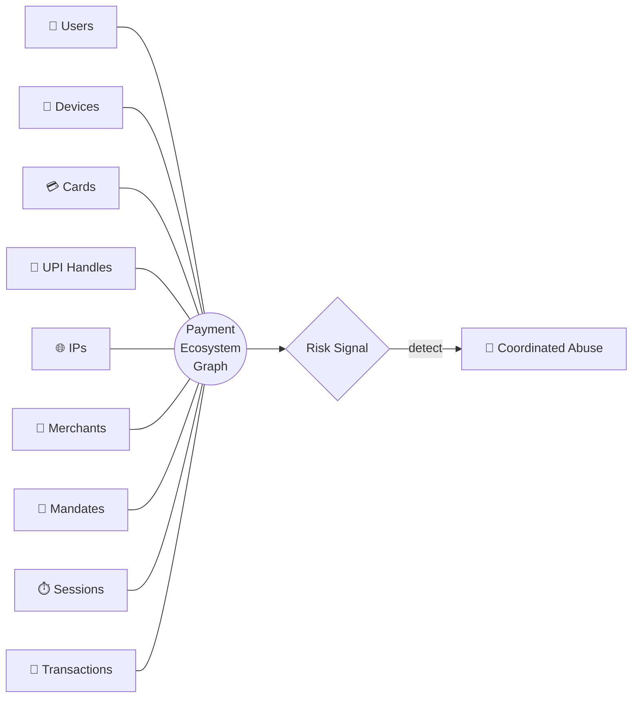

<div align="center">
# 🛡️ RingGuard 
 
### AI Risk Manager for Coordinated Payment Abuse
 
**Razorpay Buildathon · Track 2** 
 
*"Risk isn't always visible in a transaction. Sometimes it's visible in the network around it."*
 
[]()
[]()
[]()
[]()
[]()
 
</div>

## 🧭 The core idea
 
Most fraud systems ask a narrow question:
 
> "Is *this* transaction risky?"
 
RingGuard asks a wider one:
 
> **"Is the ecosystem around this transaction becoming risky?"**
 
A single transaction can look perfectly clean in isolation — right amount, right merchant, right device — while quietly belonging to a **ring**: a cluster of users, devices, cards, UPI handles, IPs, mandates, and sessions that only look coordinated once you connect the dots.
 

 
RingGuard **detects, explains, monitors, propagates, and prioritizes** risk across this heterogeneous graph, fused with temporal intelligence and behavioral signals.

## Status

Milestone-driven build. See [`IMPLEMENTATION_PLAN.md`](IMPLEMENTATION_PLAN.md) for the
full plan, audit findings, architecture, milestone gates, and evaluation protocol.

## 🚦 Build status
 
<details open>
<summary><b>Milestone tracker</b> — click to collapse</summary>

| # | Milestone | Status | Notes |
|---|-----------|:---:|---|
| M1 | Repository audit + scaffolding | ✅ | Plan, package skeleton, config, tests green |
| M2 | Synthetic payment ecosystem | ✅ | Archetypes A–H, hard negatives, demo generator, **54 tests green** |
| M3 | Graph construction + feature fusion | ⏳ | *Planned* |
| M4 | Risk propagation + explanation engine | ⏳ | *Planned* |
| M5 | Frontend (React + Cytoscape.js) | ⏳ | *Planned* |
| M6 | End-to-end demo + evaluation report | ⏳ | *Planned* |


## Stack

- **Backend:** Python 3.14 · FastAPI · Pydantic v2 · NetworkX · scikit-learn · SQLite
- **Frontend (planned):** React · TypeScript · Vite · Tailwind · Cytoscape.js
- **Testing:** pytest + pytest-cov (backend) · Vitest (frontend, planned)

## Quick start (backend)

```bash
pip install -r requirements.txt
pytest
```

## ⚠️ Data & safety notice
 
> **This prototype uses SYNTHETIC DATA ONLY.**
> No real Razorpay transactions, accounts, devices, or monetary amounts are used or implied.
> All monetary values shown are clearly labelled **SIMULATED DATA**. 